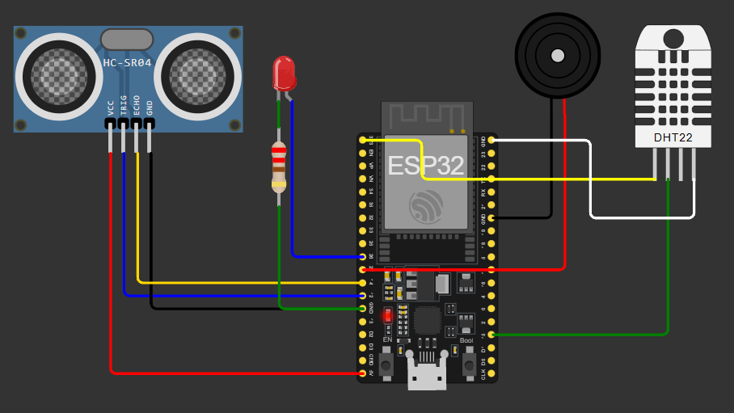
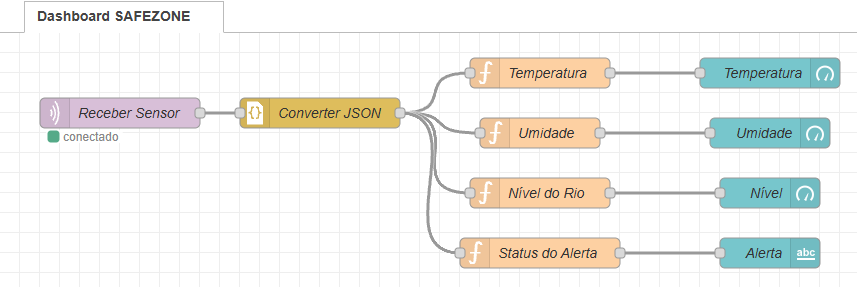
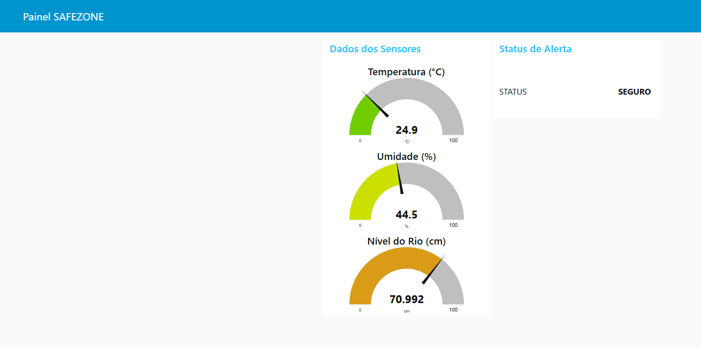
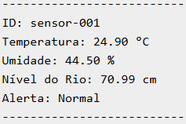

# SAFEZONE - Plataforma de Monitoramento IoT para Prevenção de Desastres

## Visão Geral

O projeto SAFEZONE é uma solução baseada em Internet das Coisas (IoT) que visa monitorar, detectar e alertar sobre situações de risco causadas por eventos naturais extremos, como enchentes e calor intenso. A plataforma integra sensores, atuadores, comunicação via MQTT e um painel interativo em Node-RED para fornecer respostas rápidas e confiáveis em tempo real.

---

## Tecnologias Utilizadas

* **ESP32 (Wokwi)**
* **Sensores**:

  * DHT22 (Temperatura e Umidade)
  * HC-SR04 (Sensor de Distância / Nível do Rio)
* **Atuadores**:

  * LED vermelho (indicador visual de alerta)
  * Buzzer (indicador sonoro de alerta)
* **MQTT Broker**: broker.hivemq.com
* **Node-RED**: Para recepção e visualização dos dados em tempo real
* Bibliotecas Utilizadas (Arduino):

  -DHT sensor library for ESPx

  -PubSubClient

  -ArduinoJson

---

## Estrutura do Projeto

```
SafeZone-IoT/
├── images/
│   ├── circuito-wokwi.png
│   ├── dashboard-node-red.png
│   ├── fluxo-node-red.png
│   └── serial-monitor.png
├── node-red/
│   └── safezone_node_red_flow.json
├── sketch.ino
├── wokwi-diagram.json
└── README.md
```

---

## Funcionalidades

1. **Monitoramento ambiental**:

   * Mede temperatura, umidade e nível da água a cada 5 segundos.

2. **Sistema de alerta inteligente**:

   * Aciona o LED e o buzzer caso:

     * Temperatura > 30ºC
     * Umidade < 40%
     * Nível do rio < 50cm

3. **Envio de dados via MQTT**:

   * Publica um JSON no tópico `safezone/sensores/001` contendo:

     ```json
     {
       "id": "sensor-001",
       "temperatura": 31.5,
       "umidade": 38.0,
       "nivel": 45.2,
       "alerta": true
     }
     ```

4. **Dashboard Web** (Node-RED):

   * Exibe os valores em tempo real
   * Indica visualmente se o alerta está ativo

---

## Como Usar o Projeto

### 1. Simular o circuito no Wokwi

1. Acesse [o circuito pronto no Wokwi.](https://wokwi.com/projects/432677368555166721)
2. Clique em "Start Simulation"

> Certifique-se de que o ESP32 está conectado ao Wi-Fi `Wokwi-GUEST`

### 2. Rodar o Node-RED localmente

1. Instale o Node.js ([https://nodejs.org](https://nodejs.org))
2. Instale o Node-RED:

   ```bash
   npm install -g node-red
   ```
3. Execute:

   ```bash
   node-red
   ```
4. Acesse o painel de controle: `http://localhost:1880`
5. Importe o arquivo `safezone_node_red_flow.json`

   * Menu → Import → Upload File → Deploy
6. Acesse o dashboard em: `http://localhost:1880/ui`

### 3. Interpretar os resultados

* Se os valores estiverem dentro dos limites seguros:

  * LED desligado, buzzer silencioso
  * Dashboard exibe "SEGURO"

* Se qualquer valor ultrapassar os limites:

  * LED acende e buzzer emite som
  * Dashboard exibe "ALERTA ATIVO"

---

## Prints de Referência

### Circuito no Wokwi



### Fluxo no Node-RED



### Dashboard de Monitoramento



### Serial Monitor com dados formatados



---

## Vídeo Pitch
[Assitir no YouTube]()

---

## Nossos integrantes
- **Gustavo Camargo de Andrade**
- RM555562
- 2TDSPF
-------------------------------------------
- **Rodrigo Souza Mantovanello**
- RM555451
- 2TDSPF
-------------------------------------------
- **Leonardo Cesar Rodrigues Nascimento**
- RM558373
- 2TDSPF
